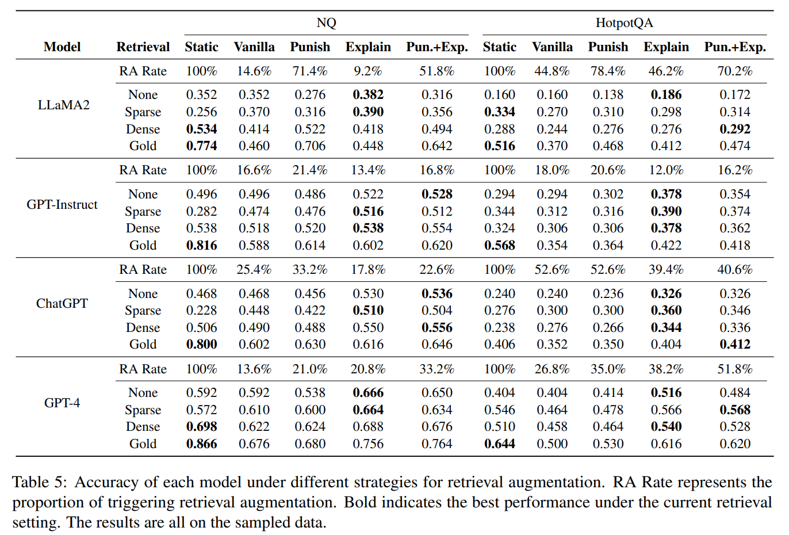

# LLM 何时需要检索增强? 减轻 LLM 的过度自信有助于检索增强

**单位 |** 中国科学院网络数据科学与技术重点实验室，中国科学院大学

**研究方向** **|** RAG、Uncertainty

**论文标题|** When Do LLMs Need Retrieval Augmentation? Mitigating LLMs’ Overconfidence Helps Retrieval Augmentation

**论文地址|** https://arxiv.org/abs/2402.1145

**代码地址|** https://github.com/ShiyuNee/（截止到2024.5.6暂未发布）

# 洞见

检索增强（RA）技术作为减轻大语言模型（LLMs）幻觉问题的一种手段，已经受到了广泛的关注。然而，由于其带来的额外计算成本以及检索结果质量的不确定性，持续不断地应用RA并非总是最优的解决方案。一个更高效的策略是仅在LLMs对某个问题缺乏把握时才启动检索过程。这种策略激发了作者提升LLMs对自身知识边界认知能力的兴趣，以更有效地辅助RA过程。
在本研究中，作者首先对LLMs识别自身知识限制的能力进行了量化评估，并揭示了它们普遍存在的过度自信问题。接着，作者探讨了LLMs对问题确定性的评估与它们对外部检索信息依赖性之间的关系。作者提出了若干方法来增强LLMs对知识边界的感知，并证实了这些方法在减少过度自信现象方面的有效性。此外，通过整合这些策略，LLMs能够在减少检索调用次数的同时，实现与RA相媲美甚至更优的性能表现。

# 动机

由于检索带来了重大开销，而检索到的文档的质量无法保证，总是进行检索以增强LLMs并不是一个理想的选择。 当LLMs具有内部知识时， 没有必要求助于外部信息，而且性能较差的检索器可能对LLMs产生不利影响。为了提高效率并避免基于不相关检索结果的回答降低问答（QA）系统的性能，关键在于强化LLMs对自身知识边界的感知能力。特别是降低它们的过分自信，这样才能通过只在它们说不知道答案时进行检索来加强RA。

# 实验

## 数据集

两个开放领域问答基准数据集：Natural Questions (NQ，测试集) 、 HotpotQA（多跳，验证集），仅使用具有短答案的问题，并将短答案设置为标签。

## 模型

开源：Vicuna-v1.5-7B 和 LLaMA2-Chat7B

闭源：GPT-Instruct (gpt-3.5-turbo-instruct)、ChatGPT (gpt-3.5-turbo-0301) 和 GPT-4 (gpt-4-1106-preview)

## 指标

准确率：如果回答包含了真实答案，则认为回答正确。

不确定性回答的比例（Unc-rate）：用来衡量模型的信心水平，较小的比例表示较高的信心水平。

另外还有新提出的三个指标（用于评估模型对知识边界的感知能力）：

Alignment = (Ncc+Niu) / N：计算综合感知水平

Overconfidence = (Nic) / N：评估过度自信程度

Conservativeness = (Ncu) / N：评估保守程度

其中N = Ncc+Nic+Ncu+Niu

## LLMs对知识边界的感知能力

在本节中，作者选择了代表性的广泛范围的LLMs，并使用基本提示来测试它们的问答性能和事实知识边界的感知水平。

结果显示： 1）LLMs的问答性能与置信度之间的对齐程度不高，所有模型都表现出过度自信，即使是最强大的模型GPT-4。例如，在NQ上，GPT-4只能正确回答不到49%的问题，但在18.94%的情况下错误地否认了其答案。 2）过度自信比保守性严重得多，这表明对知识边界的不明确感知主要源于过度自信。 3）准确性与知识边界感知之间没有明显的相关性。换句话说，准确率更高的模型的对齐程度可能更低，例如，在两个数据集上GPT-Instruct与ChatGPT相比。这表明在对话数据上进行进一步训练可能会提升知识边界的感知，但降低问答性能。

提示词如下：

## 确定性与外部信息依赖性的相关性

在检索增强下，作者需要了解LLM何时对问题表现出不确定性，以及它们是否会利用提供的外部信息。在本节中，作者研究LLMs在表达不确定性时是否倾向于依赖文档，以及模型的信心水平如何影响它们的依赖程度。

作者使用两种不同的提示（vanilla和Punish+Explain）引导模型输出其回答问题正确性的确定性，并基于这两个回应（c和cˆ）将确定性分类为四个级别。如果模型表达两次不确定性，则表示缺乏信心，而两次确定性表达则表示高信心。四个信心级别分别阐述如下: 级别0: c = 0, cˆ = 0；级别1: c = 0；级别2: c = 1； 级别3: c = 1, cˆ = 1。信心级别从级别0逐级增加至级别4。

Punish+Explain提示词如下：

作者研究两种类型支持性文档之间的关系： 黄金文档： 使用DPR提供的基准文档进行增补的文档，共有1691个带有黄金文档的问题。 腐败文档类似于黄金文档， 只是正确答案被替换为"Tom"。

作者要求模型自行决定是依赖内部知识还是依赖文档来回答问题，提示词如下：

作者测试了三种模型（即 LLaMA2、GPT-Instruct和 ChatGPT） 之间的关系， 并通过两种指标评估结果：

利用率： 对于给定问题q和文档d，再加上无增补答案a（无上下文）和有增补答案ˆa。如果Overlap(ˆa, d) − Overlap(a, d) > γ，其中γ是阈值，作者推断模型依赖文档。本文中，作者设定γ = 0。 

腐败率：a正确而ˆa错误的问题百分比。

利用率用于黄金文档，而腐败率用于错误文档。依赖黄金文档不保证获得正确答案，因为模型可能会参考文档的其他部分。因此，作者认为答案和文档之间重叠的增加是一个指标。然而，依赖腐败文档很可能生成错误答案。因此，如果模型对原本可以正确回答的问题生成错误答案，作者视其为依赖文档。

随着置信度的增加，所有模型在文档依赖性方面都呈下降趋势。这表明当语言模型表达不确定性时，它们更倾向于依赖外部文档。不管文档是否包含正确答案，对文档的整体依赖性都相当高。这意味着语言模型倾向于信任输入内容，在利用检索增强时尤其需要谨慎，特别是当检索器性能较差时。这也强调了自适应检索增强的重要。

## 对齐增强

LLMs对知识边界的负面认知主要是由于它们的过度自信所导致的。因此，作者通过减轻过度自信来增强对知识边界的认知。这可以从两个角度来实现：敦促LLMs要谨慎，并提高它们提供正确答案的能力。

减轻模型过度自信的方法：

旨在督促**LLMs**谨慎的方法：1. 惩罚: 作者在提示中加入了“如果答案不正确但你说确定会受到惩罚”，鼓励模型谨慎对待。 2. 挑战: 作者挑战生成的答案的正确性，迫使模型表达更多不确定性。 3. 逐步思考: “逐步思考”方法已被证明是增强推理能力的有效方式。因此，作者明确要求模型逐步思考，先回答问题，然后在下一步输出自信度。作者希望模型在被要求逐步思考时能认识到自己的过度自信。

旨在提升问答性能的方法：1. 生成: LLMs能够自主生成高质量的文档，从而帮助生成准确的答案。作者要求模型生成一份有助于回答问题的简短文档，最终提高回答的准确性。 2. 解释: 除了在提供答案之前生成辅助信息外，通过要求模型解释其答案的原因，可以获得更可靠的结果。这可以减轻产生缺乏合理解释的不正确回答的风险。

提示词如下：

结果如下，作者没有对Vicuna进行调查，因为它相对于其他模型来说过于自信。

发现如下：

1) 所有旨在促使模型谨慎的方法都导致了不确定响应比例的增加。挑战方法显著增加了不确定响应的比例，实现了过于自信水平的最低值和在所有方法中保守程度最高的结果。这表明LLMs倾向于相信输入并贬低自己的判断，导致过度的保守。相反，惩罚方法减弱了过度自信，而不会使模型过度保守，这通常会导致对齐度的提高。逐步思考方法在NQ数据集上减少了过度自信程度，但在HotpotQA数据集上加剧了过度自信。因此，这种方法并不特别有效。此外，惩罚和逐步思考方法可能会导致轻微的性能下降。
2) 所有旨在提高QA性能的方法都会导致更高的答案准确性。生成方法在所有方法中产生了最高的过度自信分数。可能的原因是LLMs生成有助于回答问题的文档。然而，依赖自生成的文档会使LLMs相信他们的答案是正确的。不同之处在于解释方法通常减少过度自信并保持可比较甚至更低的保守水平，从而增强LLMs对知识边界的认识。ChatGPT在HQ数据集上的过度自信水平最低，使其难以通过旨在提高准确性的方法进一步降低。
3) 惩罚方法对LLaMA2非常有效， 而解释方法对GPT-4非常有效。 这可能是因为LLaMA2表现出严重的过度自信，并且生成能力较弱，因此惩罚方法更有效。另一方面，GPT-4显示出较低水平的过度自信。鉴于其强大的生成能力，解释方法明显提高了准确性并减少了过度自信。为了结合促使模型谨慎和提高QA性能的概念，作者将惩罚和解释方法合并成一个称为Punish+Explain 的单一方法。与个别方法相比，这种方法始终增强了对齐度而不会影响准确性。

作者对其他模型使用与GPT-4相同的500个样本数据进行实验。结果如下，可以发现500个样本的结论与完整数据集的结论一致。

## 自适应检索增强

本工作侧重于确定何时进行检索而不是在所有时间触发检索，并增强LLMs利用未知质量文档的能力。在本节中，作者介绍了本文提出的用于自适应检索增强的方法。

作者在两种设置下进行检索增强：

静态检索增强：为所有问题启用检索增强。

自适应检索增强：当模型认为无法基于内部知识回答问题时，会自适应地启用检索增强，基于四个提示：Vanilla，Punish，Explain和 Punish+Explain。

检索器：包括通过Sparse检索（BM25）检索到的Sparse文档，通过Dense检索（RocketQAv2 ）检索到的Dense文档和包含正确答案的Gold文档。Dense文档代表了实际使用情况，另外两种分别代表了实际情况的下限和上限。知识来源是由DPR提供的维基百科转储。

为了专注于模型对知识边界的感知对自适应检索增强的影响，为简单起见，作者只向LLMs提供顶部第一个文档，检索性能可见于表4。

提示词如下：

结果如下：

发现：

1) 在使用黄金标准文档进行增强时，静态增强在几乎所有情况下都实现了最高的准确性。这表明包含答案的文档通常有助于回答问题。对于自适应检索增强，大多数情况下，Punish+Explain 方法取得了最佳结果，因为它持续增强了对齐而不损害问答性能。自适应检索增强所获得的最佳表现与静态增强之间并没有显著差异，在某些情况下，甚至获得可比或更好的表现，同时只利用了最少数量的检索尝试。例如，ChatGPT 利用了 Punish+Explain 策略下 40.6% 的检索，在 HotpotQA 上取得了最佳表现。
2) 自适应检索增强使 LLMs 对于可能没有帮助的文档更加健壮。当利用通过稀疏检索器检索到的文档时，观察到静态增强经常导致 NQ 上性能下降。这是因为 LLMs 在这些问题上表现良好，提供低质量文档可能会误导模型。相比之下，自适应检索增强可以减少性能损失甚至导致提升。最高的准确性通常在Explain 策略下实现，因为这种方法在本质上增强了性能并且具有相对较小的不确定性率。
3) 在真实的搜索场景中，Explain 和 Punish+Explain 策略比静态增强更有效，当文档有助于提高准确性时。作者观察到，在 NQ 上利用稀疏检索文档进行静态增强，在 HQ 上同时利用稀疏和稠密检索文档进行静态增强通常会导致性能提高。这表明这些文档通常提供帮助。与静态增强相比，自适应检索增强在 Explain 和 Punish+Explain 策略下持续实现可比甚至更优越的性能，同时需要更少的检索增强尝试。虽然自适应检索增强需要两轮推断来增强需要增强的部分，但这个比例很小，当不应用增强时输入非常简短。因此，作者的方法通常节省了开销。

# Take Away

在本文中，作者提出了几种有效的提示措施，以减轻LLMs的过度自信，使模型能更好地理解其专业领域和局限性，并验证作者提出的方法可以使自适应检索增强获益。首先，作者定义了几个度量标准，对LLMs对知识边界的感知进行定量衡量，并发现LLMs在声称是否知道答案与其实际问答表现之间的不良对齐主要是由于过度自信所致。然后，作者研究了LLMs对问题的确定性与其对外部检索信息依赖程度的相关性。作者发现LLMs倾向于依赖文档，而对问题越不确定的LLMs，则会更多地利用文档。作者提出了几种增强LLMs对知识边界感知的方法，并展示它们在减少过度自信方面是有效的。此外，借助这些方法，LLMs可以在调用更少的检索时实现与检索增强相媲美甚至更好的性能。

